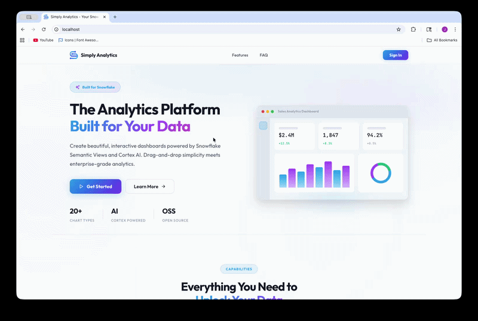

<h1 align="center">Simply Analytics</h1>

<p align="center">
  An open-source analytics platform for Snowflake with drag-and-drop dashboards, 20+ visualization types, AI-powered natural language analytics, published query endpoints, a consumption analytics dashboard, and enterprise security — deployed via Docker with a guided web-based setup wizard.
</p>

<p align="center">
  <a href="#features">Features</a> •
  <a href="#quick-start">Quick Start</a> •
  <a href="#configuration">Configuration</a> •
  <a href="#architecture">Architecture</a> •
  <a href="#testing">Testing</a> •
  <a href="#contributing">Contributing</a>
</p>

<p align="center">
  
  
  
  
</p>

<p align="center">
  
</p>

---

## Features

### Dashboards
- **20+ visualization types** — vertical bar, horizontal bar, diverging bar, line, area, pie, donut, scatter, heatmap, treemap, icicle, sankey, funnel, waterfall, radar, histogram, box plot, choropleth map, hexbin map, gauge, metric cards, data tables
- **Drag-and-drop widget editor** with field shelves, aggregation controls, filters, sorts, and calculated fields
- **Adaptive and fixed layouts** with multi-tab support and customizable canvas colors
- **Real-time data refresh** from Snowflake
- **Global dashboard filters** with cross-widget filtering
- **Export** — PNG chart export and CSV data download

### AskAI — Natural Language Analytics
- **Conversational analytics** — ask questions in plain language and get instant charts, tables, and dashboards
- **Semantic View analysis** — structured SQL generation via the Cortex Analyst REST API
- **Workspaces** — scoped environments with configured Snowflake connections and semantic views
- **Group-based access control** on workspaces
- **Persistent conversations** with encrypted message storage (AES-256-GCM)
- **Rich artifacts** — interactive charts, data tables, and multi-widget dashboard layouts generated from natural language
- **Shareable dashboards** — public share links for AI-generated dashboard artifacts
- **Export** — conversation PDF export, chart PNG export, data CSV download
- **Sample questions** — configurable per semantic view for guided exploration

### Dashboard AI Copilot
- **In-editor AI assistant** — contextual side panel with multi-provider LLM support (Cortex REST, OpenAI, Anthropic, Bedrock, Vertex, Azure)
- **Widget-aware** — focus on a specific widget for targeted modifications
- **Suggestion chips** from semantic view dimensions, measures, and facts
- **Undo stack** with revert capabilities for AI-applied changes

### Published Query Endpoints
- **Query-as-API** — publish semantic view queries as REST endpoints with parameterized inputs
- **Workspace-scoped API keys** — bearer token authentication for external consumers
- **Public and private** sharing with unique share tokens

### Consumption Dashboard
- **Admin-only analytics** — visual dashboard tracking platform usage (owner and admin roles)
- **KPI cards** — total requests, active users, login success rate, dashboard views
- **Time-series charts** — sign-in activity, request volume by type (AI / query / dashboard), active users over time
- **Popular dashboards** — leaderboard ranked by views
- **Workspace filtering** — view metrics for all workspaces or drill into a specific one
- **Date range selector** — 7-day, 30-day, and 90-day windows
- **Event tracking** — lightweight, fire-and-forget event logging across login, dashboard, query, and AI routes

### Snowflake Integration
- Direct integration with **Snowflake Semantic Views** for governed data access
- **Cortex Analyst REST API** — natural language to SQL via semantic views
- **Cortex REST API** — chat completions for AI copilot and dashboard generation
- Multiple authentication methods: PAT, key pair
- Connection pooling, role/warehouse switching

### AI Model Management
- **Multi-provider LLM abstraction** — Cortex REST, OpenAI, Anthropic, AWS Bedrock, GCP Vertex AI, Azure OpenAI
- **Platform model catalog** — define which models the platform supports with multi-cloud endpoint routing
- **Workspace AI config** — per-workspace provider and model selection with encrypted API keys
- **Health monitoring** — endpoint health checks, latency tracking, and priority-based failover

### Enterprise Security
- **Multi-factor authentication** — TOTP (Google Authenticator, Authy) and FIDO2 Passkeys (WebAuthn)
- **SAML 2.0 SSO** — Okta, Microsoft Entra ID, or any SAML IdP
- **SCIM 2.0** — automated user and group provisioning
- **RBAC** — Owner, Admin, Developer, Viewer roles with group-based dashboard and workspace access
- AES-256-GCM credential encryption at rest with key rotation
- Rate limiting, account lockout, audit logging, Helmet security headers
- Session timeout with inactivity tracking and single-session enforcement

### Web-Based Setup & Administration
- **Guided setup wizard** — configure database credentials, security keys, run migrations, and create the owner account entirely through the browser
- **Encrypted configuration** — server config stored in AES-256-GCM encrypted file with a downloadable recovery key
- **Emergency access** — recovery key login when the database is unreachable
- **Key rotation** — rotate JWT secrets, encryption keys, and recovery keys from the admin UI
- **Automated backups** — scheduled `pg_dump` snapshots with retention policy, downloadable from the admin panel
- **Backup & restore** — full backup/restore workflow with recovery key verification for cloud migration
- **System monitoring** — uptime, memory usage, active sessions, and server health at a glance

### Infrastructure
- **Bundled PostgreSQL** — metadata database runs as a Docker service with persistent volumes
- **Bundled Redis** — session management, response caching, and rate limiting with in-memory fallback
- **Auto-patching** — new tables and columns applied automatically on startup
- **WAL archiving** — continuous write-ahead log archiving for point-in-time recovery

---

## Quick Start

### Prerequisites

- Docker and Docker Compose
- A Snowflake account with Semantic Views

### Deploy

```bash
git clone https://github.com/jfarinacci/Simply-Analytics.git
cd Simply-Analytics
docker compose up -d
```

This starts four services:

| Service | Port | Description |
|---------|------|-------------|
| `postgres` | 5432 (internal) | PostgreSQL 16 metadata database with WAL archiving |
| `redis` | 6379 (internal) | Redis 7 for sessions, caching, and rate limiting |
| `api` | 3001 (internal) | Express API server with encrypted config volume |
| `client` | 80 | Nginx serving the React SPA + API proxy |

PostgreSQL and Redis are bundled and run as internal services — no external database setup required. Data is persisted across restarts via Docker volumes (`postgres-data`, `redis-data`, `config-data`, `backups-data`).

### First-Time Setup

1. Open http://localhost
2. Sign in with the bootstrap credentials: `admin` / `admin123`
3. Follow the guided wizard:
   - **Database** — set your PostgreSQL credentials for the bundled database
   - **Security** — review auto-generated JWT and encryption keys
   - **Migrations** — schema creation runs automatically
   - **Owner** — create your permanent owner account
4. Download the recovery key file when prompted — store it securely for backup/restore
5. Sign in with your new owner account

> Change the default admin password immediately after first login.

---

## Configuration

All configuration is managed through the web-based setup wizard and admin panel — no environment variables or config files to manage.

### Encrypted Config Store

Server configuration is stored in an AES-256-GCM encrypted file (`data/config.json`). During setup, a recovery key file is generated for download. Store it securely — it is required for backup/restore and emergency access.

### SSO & SCIM (Optional)

SAML SSO and SCIM provisioning are configured from the **Admin Panel > SSO & Provisioning** tab. The SCIM bearer token is auto-generated by the application and displayed for you to copy into your IdP configuration.

---

## Architecture

```
┌──────────────────────────────────────────────────────────────────┐
│                       React 18 + Vite                            │
│  Dashboard Builder · Widget Editor · AskAI · Consumption · Admin │
│  D3.js · ECharts · AG Grid · TanStack · GridStack · @dnd-kit    │
└──────────────────────────────┬───────────────────────────────────┘
                               │ REST + JWT + SSE
┌──────────────────────────────┴───────────────────────────────────┐
│                      Express API Server                          │
│  Auth · SAML SSO · SCIM · MFA · Dashboard · Ask · Consumption   │
│  Workspaces · Endpoints · Platform Models · Event Tracking       │
│  Encrypted Config Store · Helmet · Rate Limit · Redis Cache      │
└──────┬──────────────────┬─────────────────────────┬──────────────┘
       │                  │                         │
  PostgreSQL           Redis                 Snowflake SDK
       │                  │                         │
┌──────┴────────┐  ┌──────┴────────┐  ┌─────────────┴─────────────┐
│  Metadata     │  │  Sessions     │  │   Snowflake Data Cloud    │
│  Users        │  │  Cache        │  │   Semantic Views          │
│  Dashboards   │  │  Rate Limits  │  │   Cortex Analyst REST API │
│  Workspaces   │  └───────────────┘  │   Cortex REST API         │
│  Ask · Events │                     │   Queries · AI Insights   │
│  Encrypted    │                     └───────────────────────────┘
│  Credentials  │
└───────────────┘
```

### Project Structure

```
simply-analytics/
├── client/                     # React SPA
│   ├── src/
│   │   ├── api/                # API client modules (17 modules)
│   │   ├── components/
│   │   │   ├── ai/             # Dashboard AI copilot
│   │   │   ├── ask/            # Simply Ask chat components & renderers
│   │   │   ├── charts/         # 20+ visualization types (D3.js + ECharts)
│   │   │   ├── dashboard-browser/ # Folder & dashboard browsing
│   │   │   ├── dashboard-settings-modal/ # Dashboard settings & access
│   │   │   ├── dashboard-view/ # Dashboard layout, tabs & hooks
│   │   │   ├── dashboard-widget/ # Widget rendering & menus
│   │   │   ├── shared/         # Reusable UI components
│   │   │   ├── widget-editor/  # Drag-and-drop widget editor
│   │   │   └── users-management/ # User & group management
│   │   ├── store/              # Zustand state management (10 slices)
│   │   ├── utils/              # Export utilities (PNG, CSV, PDF)
│   │   └── views/              # Page-level components (9 views)
│   ├── Dockerfile
│   └── nginx.conf
├── server/                     # Express API
│   ├── src/
│   │   ├── config/             # Encrypted config store & hot reload
│   │   ├── db/                 # PostgreSQL backend, Redis, session manager
│   │   ├── middleware/         # Auth, rate limiting, session management
│   │   ├── routes/             # API endpoints (19 route files)
│   │   ├── services/           # Business logic (24 services)
│   │   └── utils/              # Encryption, query builder
│   └── Dockerfile
├── tests/                      # Vitest unit & integration tests
├── e2e/                        # Playwright end-to-end tests
├── docker-compose.yml
├── playwright.config.js
└── package.json                # Workspace root
```

### Tech Stack

| Layer | Technologies |
|-------|-------------|
| **Frontend** | React 18, Vite, Zustand, D3.js, ECharts, AG Grid, TanStack Table/Virtual, GridStack, @dnd-kit, React Router 7, html-to-image, jsPDF |
| **Backend** | Express, PostgreSQL, Redis, Snowflake SDK |
| **AI** | Snowflake Cortex Analyst REST API, Cortex REST API, OpenAI, Anthropic, AWS Bedrock, GCP Vertex AI, Azure OpenAI |
| **Auth** | JWT, bcrypt, SAML 2.0, SCIM 2.0, TOTP, WebAuthn/FIDO2 |
| **Security** | AES-256-GCM (credentials + config + messages), Helmet, express-rate-limit |
| **Testing** | Vitest, Playwright, supertest |
| **Infra** | Docker, Docker Compose, Nginx |

---

## User Roles

| Role | Dashboards | AskAI | Connections | Users | Consumption | Admin |
|------|-----------|-------|-------------|-------|-------------|-------|
| **Owner** | Full access | Full access + manage workspaces | Manage | Manage all | Full access | Full admin |
| **Admin** | Create & edit | Access via workspace groups | Manage | Manage | Full access | — |
| **Developer** | Create & edit | Access via workspace groups | View | Add members | — | — |
| **Viewer** | View only | Access via workspace groups | — | — | — | — |

---

## API Routes

| Endpoint | Description |
|----------|-------------|
| `POST /api/v1/auth/login` | Authenticate (password) |
| `POST /api/v1/auth/emergency-login` | Master key emergency access |
| `GET/POST /api/v1/2fa/*` | TOTP and Passkey management |
| `GET /api/v1/saml/login` | Initiate SAML SSO |
| `POST /api/v1/saml/callback` | SAML assertion callback |
| `/scim/v2/Users`, `/scim/v2/Groups` | SCIM 2.0 provisioning |
| `GET/POST/PUT/DELETE /api/v1/dashboard/*` | Dashboard CRUD |
| `POST /api/v1/query/execute` | Execute Snowflake queries |
| `GET /api/v1/semantic/*` | Semantic view discovery |
| `GET/POST/PUT/DELETE /api/v1/users/*` | User management |
| `GET/POST/PUT/DELETE /api/v1/connections/*` | Connection management |
| `GET/POST/PUT/DELETE /api/v1/groups/*` | Group management |
| `GET/POST/PUT/DELETE /api/v1/folders/*` | Folder management |
| `GET/POST/PUT/DELETE /api/v1/workspaces/*` | Workspace management |
| `GET/POST/DELETE /api/v1/workspaces/:id/endpoints/*` | Published query endpoints |
| `GET/POST/DELETE /api/v1/workspaces/:id/api-keys/*` | Workspace API keys |
| `GET /api/v1/pipe/:token` | Public query endpoint execution |
| `POST /api/v1/ask/message` | AskAI conversation via Cortex Analyst (SSE) |
| `GET/POST/DELETE /api/v1/ask/conversations/*` | Conversation management |
| `POST /api/v1/ask/dashboards` | Save AI-generated dashboard |
| `GET /api/v1/ask/shared/dashboard/:token` | Public shared dashboard |
| `POST /api/v1/dashboard-ai/generate` | AI dashboard generation |
| `POST /api/v1/dashboard-ai/generate-widget` | AI widget generation |
| `POST /api/v1/dashboard-ai/chat` | Dashboard AI copilot (SSE) |
| `GET /api/v1/consumption/overview` | Consumption KPI summary |
| `GET /api/v1/consumption/auth-metrics` | Sign-in success/fail over time |
| `GET /api/v1/consumption/popular-dashboards` | Dashboard popularity leaderboard |
| `GET /api/v1/consumption/request-volume` | Requests by type over time |
| `GET /api/v1/consumption/active-users` | Active user counts over time |
| `GET/POST /api/v1/platform/*` | Platform model catalog management |
| `GET/PUT /api/v1/admin/config` | Admin configuration |
| `POST /api/v1/admin/migrate` | Schema migrations (SSE) |
| `POST /api/v1/admin/rotate-key/:type` | Key rotation (jwt/encryption/recovery) |
| `GET/POST /api/v1/admin/backups/*` | Backup management (list, create, download, restore) |
| `GET /api/v1/admin/system` | System health info |
| `GET/POST /api/v1/setup/*` | Initial setup wizard |

---

## Testing

Simply Analytics includes unit, integration, and end-to-end tests.

### Unit & Integration Tests

```bash
# Run all tests
npm test

# Server tests only
npm run test:server

# Client tests only
npm run test:client
```

Tests use [Vitest](https://vitest.dev/) with jsdom for client component tests and [supertest](https://github.com/ladjs/supertest) for server API tests.

### End-to-End Tests

```bash
# Install Playwright browsers (first time)
npx playwright install

# Run E2E tests
npm run test:e2e
```

E2E tests use [Playwright](https://playwright.dev/) and automatically start the dev server.

---

## Troubleshooting

**Port conflict:**
```bash
lsof -ti:3001 | xargs kill -9
```

**Snowflake network policy errors:**
Ensure your IP is allowlisted or connect through VPN, then use the Reconnect button.

**Lost recovery key:**
If you lose the recovery key file, delete `data/config.json` and `data/.master-key`, then re-run the setup wizard. All configuration will need to be re-entered. Backups encrypted with the old key cannot be restored.

**Emergency database access:**
If the database is unreachable, use the recovery key to sign in via the emergency login flow. Update your database credentials from the admin panel, then sign out and back in normally.

**Docker volume persistence:**
All data is stored in Docker volumes. To reset the application completely:
```bash
docker compose down -v
docker compose up -d
```

---

## Contributing

Contributions are welcome! Please open an issue or submit a pull request.

1. Fork the repository
2. Create your branch (`git checkout -b feature/my-feature`)
3. Commit your changes (`git commit -m 'Add my feature'`)
4. Push (`git push origin feature/my-feature`)
5. Open a Pull Request

---

## License

[Apache 2.0](LICENSE.md) — Jorge Farinacci
